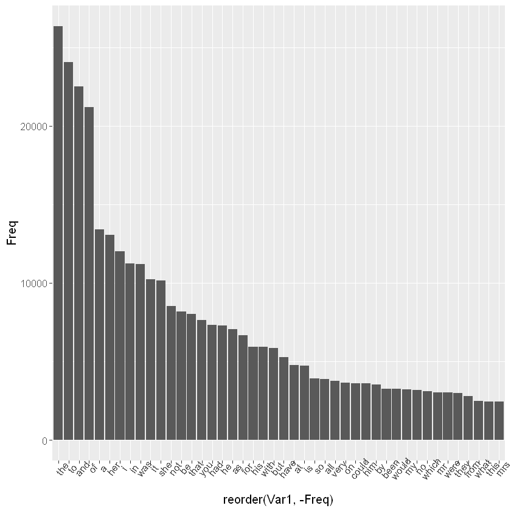

---
title: Text Mining - Basics 
nav: true
--- 

# Text Mining - Exploration

How to deal with variables like: *natural language*.


```R
# loading packages
library(tidyverse)
library(tidytext)
library(janeaustenr)
library(stringr)
```

I'll load Jane Austen books from the package janeaustenr and do some cleaning.


```R
original_books <- austen_books() %>%
  group_by(book) %>%
  mutate(linenumber = row_number(),
         chapter = cumsum(str_detect(text, regex("^chapter [\\divxlc]",
                                                 ignore_case = TRUE)))) %>%
  ungroup()
```


```R
original_books
```


<table>
<caption>A tibble: 73422 × 4</caption>
<thead>
	<tr><th scope=col>text</th><th scope=col>book</th><th scope=col>linenumber</th><th scope=col>chapter</th></tr>
	<tr><th scope=col>&lt;chr&gt;</th><th scope=col>&lt;fct&gt;</th><th scope=col>&lt;int&gt;</th><th scope=col>&lt;int&gt;</th></tr>
</thead>
<tbody>
	<tr><td><span style=white-space:pre-wrap>SENSE AND SENSIBILITY                                                  </span></td><td>Sense &amp; Sensibility</td><td> 1</td><td>0</td></tr>
	<tr><td><span style=white-space:pre-wrap>                                                                       </span></td><td>Sense &amp; Sensibility</td><td> 2</td><td>0</td></tr>
	<tr><td><span style=white-space:pre-wrap>by Jane Austen                                                         </span></td><td>Sense &amp; Sensibility</td><td> 3</td><td>0</td></tr>
	<tr><td><span style=white-space:pre-wrap>                                                                       </span></td><td>Sense &amp; Sensibility</td><td> 4</td><td>0</td></tr>
	<tr><td><span style=white-space:pre-wrap>(1811)                                                                 </span></td><td>Sense &amp; Sensibility</td><td> 5</td><td>0</td></tr>
	<tr><td><span style=white-space:pre-wrap>                                                                       </span></td><td>Sense &amp; Sensibility</td><td> 6</td><td>0</td></tr>
	<tr><td><span style=white-space:pre-wrap>                                                                       </span></td><td>Sense &amp; Sensibility</td><td> 7</td><td>0</td></tr>
	<tr><td><span style=white-space:pre-wrap>                                                                       </span></td><td>Sense &amp; Sensibility</td><td> 8</td><td>0</td></tr>
	<tr><td><span style=white-space:pre-wrap>                                                                       </span></td><td>Sense &amp; Sensibility</td><td> 9</td><td>0</td></tr>
	<tr><td><span style=white-space:pre-wrap>CHAPTER 1                                                              </span></td><td>Sense &amp; Sensibility</td><td>10</td><td>1</td></tr>
	<tr><td><span style=white-space:pre-wrap>                                                                       </span></td><td>Sense &amp; Sensibility</td><td>11</td><td>1</td></tr>
	<tr><td><span style=white-space:pre-wrap>                                                                       </span></td><td>Sense &amp; Sensibility</td><td>12</td><td>1</td></tr>
	<tr><td><span style=white-space:pre-wrap>The family of Dashwood had long been settled in Sussex.  Their estate  </span></td><td>Sense &amp; Sensibility</td><td>13</td><td>1</td></tr>
	<tr><td><span style=white-space:pre-wrap>was large, and their residence was at Norland Park, in the centre of   </span></td><td>Sense &amp; Sensibility</td><td>14</td><td>1</td></tr>
	<tr><td><span style=white-space:pre-wrap>their property, where, for many generations, they had lived in so      </span></td><td>Sense &amp; Sensibility</td><td>15</td><td>1</td></tr>
	<tr><td><span style=white-space:pre-wrap>respectable a manner as to engage the general good opinion of their    </span></td><td>Sense &amp; Sensibility</td><td>16</td><td>1</td></tr>
	<tr><td><span style=white-space:pre-wrap>surrounding acquaintance.  The late owner of this estate was a single  </span></td><td>Sense &amp; Sensibility</td><td>17</td><td>1</td></tr>
	<tr><td><span style=white-space:pre-wrap>man, who lived to a very advanced age, and who for many years of his   </span></td><td>Sense &amp; Sensibility</td><td>18</td><td>1</td></tr>
	<tr><td><span style=white-space:pre-wrap>life, had a constant companion and housekeeper in his sister.  But her </span></td><td>Sense &amp; Sensibility</td><td>19</td><td>1</td></tr>
	<tr><td><span style=white-space:pre-wrap>death, which happened ten years before his own, produced a great       </span></td><td>Sense &amp; Sensibility</td><td>20</td><td>1</td></tr>
	<tr><td>alteration in his home; for to supply her loss, he invited and received</td><td>Sense &amp; Sensibility</td><td>21</td><td>1</td></tr>
	<tr><td><span style=white-space:pre-wrap>into his house the family of his nephew Mr. Henry Dashwood, the legal  </span></td><td>Sense &amp; Sensibility</td><td>22</td><td>1</td></tr>
	<tr><td>inheritor of the Norland estate, and the person to whom he intended to </td><td>Sense &amp; Sensibility</td><td>23</td><td>1</td></tr>
	<tr><td><span style=white-space:pre-wrap>bequeath it.  In the society of his nephew and niece, and their        </span></td><td>Sense &amp; Sensibility</td><td>24</td><td>1</td></tr>
	<tr><td><span style=white-space:pre-wrap>children, the old Gentleman's days were comfortably spent.  His        </span></td><td>Sense &amp; Sensibility</td><td>25</td><td>1</td></tr>
	<tr><td><span style=white-space:pre-wrap>attachment to them all increased.  The constant attention of Mr. and   </span></td><td>Sense &amp; Sensibility</td><td>26</td><td>1</td></tr>
	<tr><td><span style=white-space:pre-wrap>Mrs. Henry Dashwood to his wishes, which proceeded not merely from     </span></td><td>Sense &amp; Sensibility</td><td>27</td><td>1</td></tr>
	<tr><td><span style=white-space:pre-wrap>interest, but from goodness of heart, gave him every degree of solid   </span></td><td>Sense &amp; Sensibility</td><td>28</td><td>1</td></tr>
	<tr><td><span style=white-space:pre-wrap>comfort which his age could receive; and the cheerfulness of the       </span></td><td>Sense &amp; Sensibility</td><td>29</td><td>1</td></tr>
	<tr><td><span style=white-space:pre-wrap>children added a relish to his existence.                              </span></td><td>Sense &amp; Sensibility</td><td>30</td><td>1</td></tr>
	<tr><td>...</td><td>...</td><td>...</td><td>...</td></tr>
	<tr><td>                                                                       </td><td>Persuasion</td><td>8299</td><td>24</td></tr>
	<tr><td>Her recent good offices by Anne had been enough in themselves, and     </td><td>Persuasion</td><td>8300</td><td>24</td></tr>
	<tr><td>their marriage, instead of depriving her of one friend, secured her    </td><td>Persuasion</td><td>8301</td><td>24</td></tr>
	<tr><td>two.  She was their earliest visitor in their settled life; and Captain</td><td>Persuasion</td><td>8302</td><td>24</td></tr>
	<tr><td>Wentworth, by putting her in the way of recovering her husband's       </td><td>Persuasion</td><td>8303</td><td>24</td></tr>
	<tr><td>property in the West Indies, by writing for her, acting for her, and   </td><td>Persuasion</td><td>8304</td><td>24</td></tr>
	<tr><td>seeing her through all the petty difficulties of the case with the     </td><td>Persuasion</td><td>8305</td><td>24</td></tr>
	<tr><td>activity and exertion of a fearless man and a determined friend, fully </td><td>Persuasion</td><td>8306</td><td>24</td></tr>
	<tr><td>requited the services which she had rendered, or ever meant to render, </td><td>Persuasion</td><td>8307</td><td>24</td></tr>
	<tr><td>to his wife.                                                           </td><td>Persuasion</td><td>8308</td><td>24</td></tr>
	<tr><td>                                                                       </td><td>Persuasion</td><td>8309</td><td>24</td></tr>
	<tr><td>Mrs Smith's enjoyments were not spoiled by this improvement of income, </td><td>Persuasion</td><td>8310</td><td>24</td></tr>
	<tr><td>with some improvement of health, and the acquisition of such friends to</td><td>Persuasion</td><td>8311</td><td>24</td></tr>
	<tr><td>be often with, for her cheerfulness and mental alacrity did not fail   </td><td>Persuasion</td><td>8312</td><td>24</td></tr>
	<tr><td>her; and while these prime supplies of good remained, she might have   </td><td>Persuasion</td><td>8313</td><td>24</td></tr>
	<tr><td>bid defiance even to greater accessions of worldly prosperity.  She    </td><td>Persuasion</td><td>8314</td><td>24</td></tr>
	<tr><td>might have been absolutely rich and perfectly healthy, and yet be      </td><td>Persuasion</td><td>8315</td><td>24</td></tr>
	<tr><td>happy.  Her spring of felicity was in the glow of her spirits, as her  </td><td>Persuasion</td><td>8316</td><td>24</td></tr>
	<tr><td>friend Anne's was in the warmth of her heart.  Anne was tenderness     </td><td>Persuasion</td><td>8317</td><td>24</td></tr>
	<tr><td>itself, and she had the full worth of it in Captain Wentworth's        </td><td>Persuasion</td><td>8318</td><td>24</td></tr>
	<tr><td>affection.  His profession was all that could ever make her friends    </td><td>Persuasion</td><td>8319</td><td>24</td></tr>
	<tr><td>wish that tenderness less, the dread of a future war all that could dim</td><td>Persuasion</td><td>8320</td><td>24</td></tr>
	<tr><td>her sunshine.  She gloried in being a sailor's wife, but she must pay  </td><td>Persuasion</td><td>8321</td><td>24</td></tr>
	<tr><td>the tax of quick alarm for belonging to that profession which is, if   </td><td>Persuasion</td><td>8322</td><td>24</td></tr>
	<tr><td>possible, more distinguished in its domestic virtues than in its       </td><td>Persuasion</td><td>8323</td><td>24</td></tr>
	<tr><td>national importance.                                                   </td><td>Persuasion</td><td>8324</td><td>24</td></tr>
	<tr><td>                                                                       </td><td>Persuasion</td><td>8325</td><td>24</td></tr>
	<tr><td>                                                                       </td><td>Persuasion</td><td>8326</td><td>24</td></tr>
	<tr><td>                                                                       </td><td>Persuasion</td><td>8327</td><td>24</td></tr>
	<tr><td>Finis                                                                  </td><td>Persuasion</td><td>8328</td><td>24</td></tr>
</tbody>
</table>


Now I'll change the form of the dataframe using a function from the `tidytext` package called the `unnest_tokens()` function.


```R
tidy_books <- original_books %>%
  unnest_tokens(word, text)
```


```R
tidy_books
```


<table>
<caption>A tibble: 725055 × 4</caption>
<thead>
	<tr><th scope=col>book</th><th scope=col>linenumber</th><th scope=col>chapter</th><th scope=col>word</th></tr>
	<tr><th scope=col>&lt;fct&gt;</th><th scope=col>&lt;int&gt;</th><th scope=col>&lt;int&gt;</th><th scope=col>&lt;chr&gt;</th></tr>
</thead>
<tbody>
	<tr><td>Sense &amp; Sensibility</td><td> 1</td><td>0</td><td><span style=white-space:pre-wrap>sense      </span></td></tr>
	<tr><td>Sense &amp; Sensibility</td><td> 1</td><td>0</td><td><span style=white-space:pre-wrap>and        </span></td></tr>
	<tr><td>Sense &amp; Sensibility</td><td> 1</td><td>0</td><td>sensibility</td></tr>
	<tr><td>Sense &amp; Sensibility</td><td> 3</td><td>0</td><td><span style=white-space:pre-wrap>by         </span></td></tr>
	<tr><td>Sense &amp; Sensibility</td><td> 3</td><td>0</td><td><span style=white-space:pre-wrap>jane       </span></td></tr>
	<tr><td>Sense &amp; Sensibility</td><td> 3</td><td>0</td><td><span style=white-space:pre-wrap>austen     </span></td></tr>
	<tr><td>Sense &amp; Sensibility</td><td> 5</td><td>0</td><td><span style=white-space:pre-wrap>1811       </span></td></tr>
	<tr><td>Sense &amp; Sensibility</td><td>10</td><td>1</td><td><span style=white-space:pre-wrap>chapter    </span></td></tr>
	<tr><td>Sense &amp; Sensibility</td><td>10</td><td>1</td><td><span style=white-space:pre-wrap>1          </span></td></tr>
	<tr><td>Sense &amp; Sensibility</td><td>13</td><td>1</td><td><span style=white-space:pre-wrap>the        </span></td></tr>
	<tr><td>Sense &amp; Sensibility</td><td>13</td><td>1</td><td><span style=white-space:pre-wrap>family     </span></td></tr>
	<tr><td>Sense &amp; Sensibility</td><td>13</td><td>1</td><td><span style=white-space:pre-wrap>of         </span></td></tr>
	<tr><td>Sense &amp; Sensibility</td><td>13</td><td>1</td><td><span style=white-space:pre-wrap>dashwood   </span></td></tr>
	<tr><td>Sense &amp; Sensibility</td><td>13</td><td>1</td><td><span style=white-space:pre-wrap>had        </span></td></tr>
	<tr><td>Sense &amp; Sensibility</td><td>13</td><td>1</td><td><span style=white-space:pre-wrap>long       </span></td></tr>
	<tr><td>Sense &amp; Sensibility</td><td>13</td><td>1</td><td><span style=white-space:pre-wrap>been       </span></td></tr>
	<tr><td>Sense &amp; Sensibility</td><td>13</td><td>1</td><td><span style=white-space:pre-wrap>settled    </span></td></tr>
	<tr><td>Sense &amp; Sensibility</td><td>13</td><td>1</td><td><span style=white-space:pre-wrap>in         </span></td></tr>
	<tr><td>Sense &amp; Sensibility</td><td>13</td><td>1</td><td><span style=white-space:pre-wrap>sussex     </span></td></tr>
	<tr><td>Sense &amp; Sensibility</td><td>13</td><td>1</td><td><span style=white-space:pre-wrap>their      </span></td></tr>
	<tr><td>Sense &amp; Sensibility</td><td>13</td><td>1</td><td><span style=white-space:pre-wrap>estate     </span></td></tr>
	<tr><td>Sense &amp; Sensibility</td><td>14</td><td>1</td><td><span style=white-space:pre-wrap>was        </span></td></tr>
	<tr><td>Sense &amp; Sensibility</td><td>14</td><td>1</td><td><span style=white-space:pre-wrap>large      </span></td></tr>
	<tr><td>Sense &amp; Sensibility</td><td>14</td><td>1</td><td><span style=white-space:pre-wrap>and        </span></td></tr>
	<tr><td>Sense &amp; Sensibility</td><td>14</td><td>1</td><td><span style=white-space:pre-wrap>their      </span></td></tr>
	<tr><td>Sense &amp; Sensibility</td><td>14</td><td>1</td><td><span style=white-space:pre-wrap>residence  </span></td></tr>
	<tr><td>Sense &amp; Sensibility</td><td>14</td><td>1</td><td><span style=white-space:pre-wrap>was        </span></td></tr>
	<tr><td>Sense &amp; Sensibility</td><td>14</td><td>1</td><td><span style=white-space:pre-wrap>at         </span></td></tr>
	<tr><td>Sense &amp; Sensibility</td><td>14</td><td>1</td><td><span style=white-space:pre-wrap>norland    </span></td></tr>
	<tr><td>Sense &amp; Sensibility</td><td>14</td><td>1</td><td><span style=white-space:pre-wrap>park       </span></td></tr>
	<tr><td>...</td><td>...</td><td>...</td><td>...</td></tr>
	<tr><td>Persuasion</td><td>8321</td><td>24</td><td>but          </td></tr>
	<tr><td>Persuasion</td><td>8321</td><td>24</td><td>she          </td></tr>
	<tr><td>Persuasion</td><td>8321</td><td>24</td><td>must         </td></tr>
	<tr><td>Persuasion</td><td>8321</td><td>24</td><td>pay          </td></tr>
	<tr><td>Persuasion</td><td>8322</td><td>24</td><td>the          </td></tr>
	<tr><td>Persuasion</td><td>8322</td><td>24</td><td>tax          </td></tr>
	<tr><td>Persuasion</td><td>8322</td><td>24</td><td>of           </td></tr>
	<tr><td>Persuasion</td><td>8322</td><td>24</td><td>quick        </td></tr>
	<tr><td>Persuasion</td><td>8322</td><td>24</td><td>alarm        </td></tr>
	<tr><td>Persuasion</td><td>8322</td><td>24</td><td>for          </td></tr>
	<tr><td>Persuasion</td><td>8322</td><td>24</td><td>belonging    </td></tr>
	<tr><td>Persuasion</td><td>8322</td><td>24</td><td>to           </td></tr>
	<tr><td>Persuasion</td><td>8322</td><td>24</td><td>that         </td></tr>
	<tr><td>Persuasion</td><td>8322</td><td>24</td><td>profession   </td></tr>
	<tr><td>Persuasion</td><td>8322</td><td>24</td><td>which        </td></tr>
	<tr><td>Persuasion</td><td>8322</td><td>24</td><td>is           </td></tr>
	<tr><td>Persuasion</td><td>8322</td><td>24</td><td>if           </td></tr>
	<tr><td>Persuasion</td><td>8323</td><td>24</td><td>possible     </td></tr>
	<tr><td>Persuasion</td><td>8323</td><td>24</td><td>more         </td></tr>
	<tr><td>Persuasion</td><td>8323</td><td>24</td><td>distinguished</td></tr>
	<tr><td>Persuasion</td><td>8323</td><td>24</td><td>in           </td></tr>
	<tr><td>Persuasion</td><td>8323</td><td>24</td><td>its          </td></tr>
	<tr><td>Persuasion</td><td>8323</td><td>24</td><td>domestic     </td></tr>
	<tr><td>Persuasion</td><td>8323</td><td>24</td><td>virtues      </td></tr>
	<tr><td>Persuasion</td><td>8323</td><td>24</td><td>than         </td></tr>
	<tr><td>Persuasion</td><td>8323</td><td>24</td><td>in           </td></tr>
	<tr><td>Persuasion</td><td>8323</td><td>24</td><td>its          </td></tr>
	<tr><td>Persuasion</td><td>8324</td><td>24</td><td>national     </td></tr>
	<tr><td>Persuasion</td><td>8324</td><td>24</td><td>importance   </td></tr>
	<tr><td>Persuasion</td><td>8328</td><td>24</td><td>finis        </td></tr>
</tbody>
</table>


The function separates all the words from the text lines.

Nexr I will display the words more used in all the books:


```R
# first create a table of frequency of the words
words = table(tidy_books$word)
```


```R
# omitting NAs and omitting all the words with frequency > than
wd = na.omit(words[words > dim(words)/6])
wd
```


    
        a   all   and    as    at    be  been   but    by could   for  from   had 
    13408  3871 22515  7033  4751  8163  3255  5866  3545  3613  6648  2795  7322 
     have    he   her   him   his     i    in    is    it    mr   mrs    my    no 
     5259  7292 13055  3601  5947 12006 11217  4746 10234  3015  2446  3206  3185 
      not    of    on   she    so  that   the  they  this    to  very   was  were 
     8531 21178  3655 10137  3898  8009 26351  2983  2452 24044  3752 11204  3006 
     what which  with would   you 
     2471  3112  5916  3238  7631 


```R
# creating a data.frame and ordering by word frequency
ws = as.data.frame(wd)
ord_ws = ws[order(-ws$Freq),] 
head(ord_ws)
```


<ol class=list-inline>
	<li>44</li>
	<li>2</li>
</ol>


<table>
<caption>A data.frame: 6 × 2</caption>
<thead>
	<tr><th></th><th scope=col>Var1</th><th scope=col>Freq</th></tr>
	<tr><th></th><th scope=col>&lt;fct&gt;</th><th scope=col>&lt;int&gt;</th></tr>
</thead>
<tbody>
	<tr><th scope=row>33</th><td>the</td><td>26351</td></tr>
	<tr><th scope=row>36</th><td>to </td><td>24044</td></tr>
	<tr><th scope=row>3</th><td>and</td><td>22515</td></tr>
	<tr><th scope=row>28</th><td>of </td><td>21178</td></tr>
	<tr><th scope=row>1</th><td>a  </td><td>13408</td></tr>
	<tr><th scope=row>16</th><td>her</td><td>13055</td></tr>
</tbody>
</table>


Now we can see the first 6 words with the most frequency count in all the books. Let's plot:


```R
ggplot(ord_ws, aes(x = reorder (Var1, -Freq), y = Freq)) +
    geom_bar(stat = "identity") +
    theme(text = element_text(size = 12), axis.text.x = element_text(angle = 50))
```




