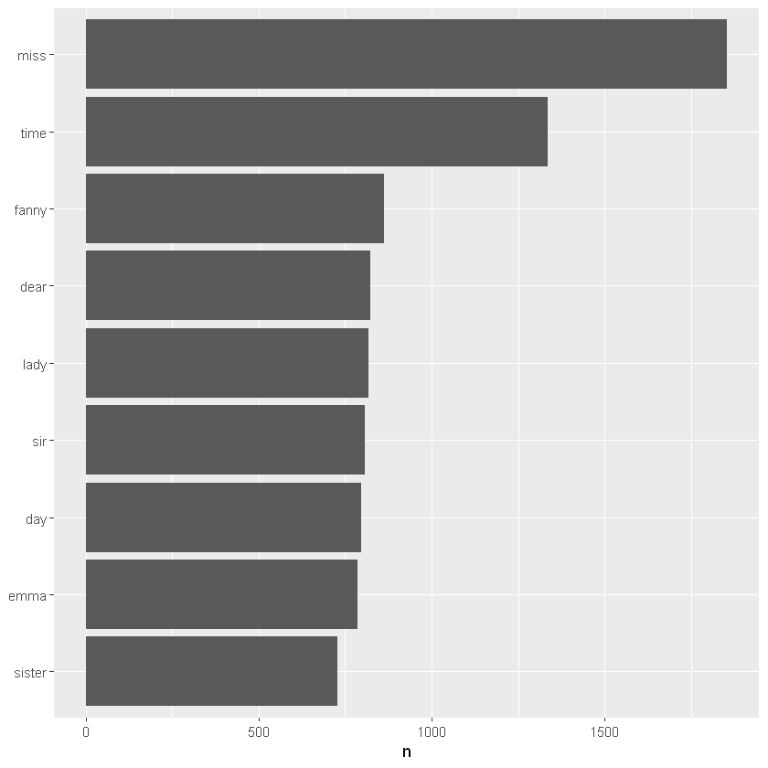

#  Case Study: Jane_Austen_novels_text_mining_R

## Getting the dataframe right

We're going to analyse some very messy datasets - books - and visualise the relationships between them.


```R
library(tidyverse)
library(tidytext)
library(janeaustenr)
library(stringr)

# import and tidy them so that each word is a subject
original_books <- austen_books() %>%
  group_by(book) %>%
  mutate(linenumber = row_number(),
         chapter = cumsum(str_detect(text, regex("^chapter [\\divxlc]",
                                                 ignore_case = TRUE)))) %>%
  ungroup()
tidy_books <- original_books %>%
  unnest_tokens(word, text)
```

    Warning message:
    "package 'tidyverse' was built under R version 3.6.2"-- Attaching packages --------------------------------------- tidyverse 1.3.0 --
    v ggplot2 3.2.1     v purrr   0.3.3
    v tibble  2.1.3     v dplyr   0.8.3
    v tidyr   1.0.0     v stringr 1.4.0
    v readr   1.3.1     v forcats 0.4.0
    Warning message:
    "package 'stringr' was built under R version 3.6.2"-- Conflicts ------------------------------------------ tidyverse_conflicts() --
    x dplyr::filter() masks stats::filter()
    x dplyr::lag()    masks stats::lag()
    Warning message:
    "package 'tidytext' was built under R version 3.6.2"Warning message:
    "package 'janeaustenr' was built under R version 3.6.2"

Now, if we want to count the number of instances of each word, we can use the count function in the dplyr package.


```R
library(dplyr)
#I'll use the "pipe" function %>% to pass the output of each line directly to the next
tidy_books %>% 
  anti_join(stop_words) %>% #remove common "stop words" here before counting
  count(word, sort = TRUE)
```

    Joining, by = "word"
    


<table>
<caption>A tibble: 13914 × 2</caption>
<thead>
	<tr><th scope=col>word</th><th scope=col>n</th></tr>
	<tr><th scope=col>&lt;chr&gt;</th><th scope=col>&lt;int&gt;</th></tr>
</thead>
<tbody>
	<tr><td>miss     </td><td>1855</td></tr>
	<tr><td>time     </td><td>1337</td></tr>
	<tr><td>fanny    </td><td> 862</td></tr>
	<tr><td>dear     </td><td> 822</td></tr>
	<tr><td>lady     </td><td> 817</td></tr>
	<tr><td>sir      </td><td> 806</td></tr>
	<tr><td>day      </td><td> 797</td></tr>
	<tr><td>emma     </td><td> 787</td></tr>
	<tr><td>sister   </td><td> 727</td></tr>
	<tr><td>house    </td><td> 699</td></tr>
	<tr><td>elizabeth</td><td> 687</td></tr>
	<tr><td>elinor   </td><td> 623</td></tr>
	<tr><td>hope     </td><td> 601</td></tr>
	<tr><td>friend   </td><td> 593</td></tr>
	<tr><td>family   </td><td> 578</td></tr>
	<tr><td>mind     </td><td> 563</td></tr>
	<tr><td>father   </td><td> 558</td></tr>
	<tr><td>home     </td><td> 550</td></tr>
	<tr><td>jane     </td><td> 550</td></tr>
	<tr><td>mother   </td><td> 541</td></tr>
	<tr><td>catherine</td><td> 539</td></tr>
	<tr><td>feelings </td><td> 535</td></tr>
	<tr><td>happy    </td><td> 534</td></tr>
	<tr><td>moment   </td><td> 515</td></tr>
	<tr><td>half     </td><td> 501</td></tr>
	<tr><td>love     </td><td> 495</td></tr>
	<tr><td>till     </td><td> 495</td></tr>
	<tr><td>crawford </td><td> 493</td></tr>
	<tr><td>marianne </td><td> 492</td></tr>
	<tr><td>heart    </td><td> 470</td></tr>
	<tr><td>...</td><td>...</td></tr>
	<tr><td>xxi       </td><td>1</td></tr>
	<tr><td>xxii      </td><td>1</td></tr>
	<tr><td>xxiii     </td><td>1</td></tr>
	<tr><td>xxiv      </td><td>1</td></tr>
	<tr><td>xxix      </td><td>1</td></tr>
	<tr><td>xxv       </td><td>1</td></tr>
	<tr><td>xxvi      </td><td>1</td></tr>
	<tr><td>xxvii     </td><td>1</td></tr>
	<tr><td>xxviii    </td><td>1</td></tr>
	<tr><td>xxx       </td><td>1</td></tr>
	<tr><td>xxxi      </td><td>1</td></tr>
	<tr><td>xxxii     </td><td>1</td></tr>
	<tr><td>xxxiii    </td><td>1</td></tr>
	<tr><td>xxxiv     </td><td>1</td></tr>
	<tr><td>xxxix     </td><td>1</td></tr>
	<tr><td>xxxv      </td><td>1</td></tr>
	<tr><td>xxxvi     </td><td>1</td></tr>
	<tr><td>xxxvii    </td><td>1</td></tr>
	<tr><td>xxxviii   </td><td>1</td></tr>
	<tr><td>yawned    </td><td>1</td></tr>
	<tr><td>yawning   </td><td>1</td></tr>
	<tr><td>yawns     </td><td>1</td></tr>
	<tr><td>year's    </td><td>1</td></tr>
	<tr><td>yeomanry  </td><td>1</td></tr>
	<tr><td>yeomen    </td><td>1</td></tr>
	<tr><td>yestermorn</td><td>1</td></tr>
	<tr><td>younker   </td><td>1</td></tr>
	<tr><td>your's    </td><td>1</td></tr>
	<tr><td>youths    </td><td>1</td></tr>
	<tr><td>zigzags   </td><td>1</td></tr>
</tbody>
</table>


Make a plot by piping directly to `ggplot`:


```R
tidy_books %>%
  anti_join(stop_words) %>%
  count(word, sort = TRUE) %>%
  filter(n > 700) %>%
  mutate(word = reorder(word, n)) %>% # neater way to reorder
  ggplot(aes(word, n)) +
  geom_col() +
  xlab(NULL) +
  coord_flip()
```

    Joining, by = "word"
    





```R

```
