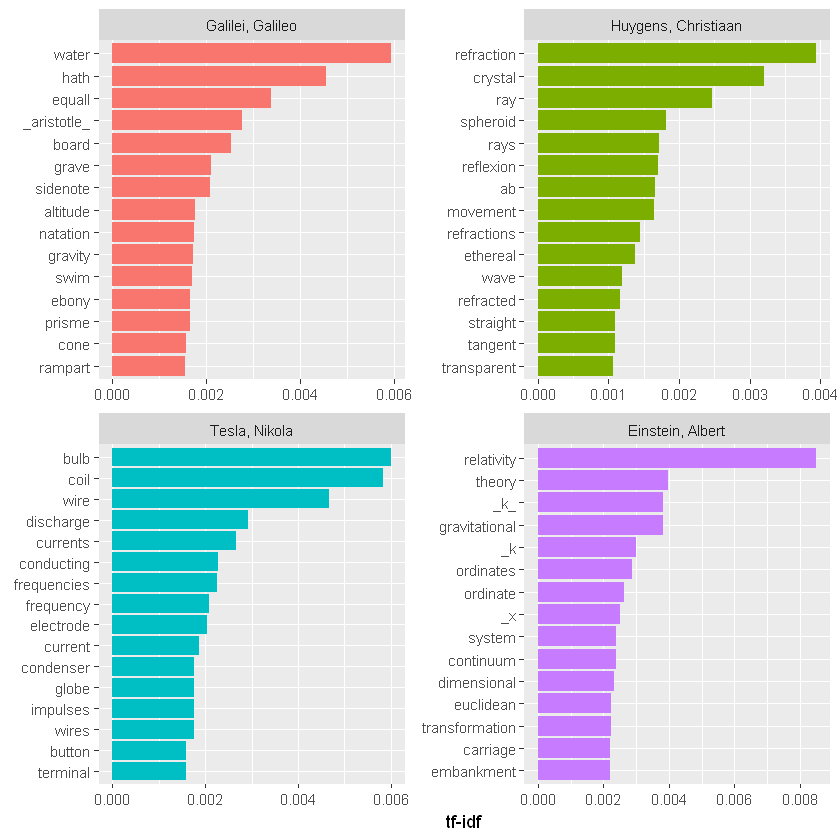

---
title: Inverse Document Frequency (TF-IDF)
cas: true
--- 


# Term Frequency - Inverse Document Frequency (TF-IDF): Mathematics and R code

Text analysis of frequent words wrote by famous mathematicians. I'll look at some common transformations we can make on these types of datasets. "stop words" has to be taken into account. We'd like to transform text data to emphasise the words which carry meaning, and the words which help us distinguish between them.

One common transformation to do this is called ***term frequency** - inverse document frequency (TF-IDF)*. For a given word or term t in a set of documents we can apply this formula:


Where **Nt = Number of instances of *t* in document**, **Tt = Total number of terms in document**


)
  

Where **Td = Total number of documents**, **Tt = Number of documents in which *t* appears**

And then the *TF-IDF* transformation for t (the product of these two, **TF(t)×IDF(t)**). Each word now has a weight, based on how it appears across all documents. While *TF* gives higher weight to common words, *IDF* weights words which only occur in fewer documents, so the product emphasises words which are distinguished between all documents.

First, we'll need to download books by some physicists from Project Gutenberg by utilizing the author ID (this *ID* can be found looking up the end of link to the author page on Project Gutenberg website):


```R
library(tidyverse)
library(gutenbergr)
library(tidytext)

#using gutenbergr library to access data
physics <- gutenberg_download(c(37729, 14725, 13476, 30155), 
                              meta_fields = "author")
```
Now we need now to break the text into individual tokens (a process called tokenization) and transform it to a tidy data structure. To do this, we use tidytext’s ```unnest_tokens()``` function. 

```R
#gathering words
physics_words <- physics %>%
  #tokenization with tidytext library 
  unnest_tokens(word, text) %>%
  count(author, word, sort = TRUE) %>%
  ungroup()

print(physics_words)
```


```
# A tibble: 12,671 x 3
   author              word      n
   <chr>               <chr> <int>
 1 Galilei, Galileo    the    3760
 2 Tesla, Nikola       the    3604
 3 Huygens, Christiaan the    3553
 4 Einstein, Albert    the    2993
 5 Galilei, Galileo    of     2049
 6 Einstein, Albert    of     2028
 7 Tesla, Nikola       of     1737
 8 Huygens, Christiaan of     1708
 9 Huygens, Christiaan to     1207
10 Tesla, Nikola       a      1176
# ... with 12,661 more rows
```

    

These famous scientists write "the" and "of" a lot. This is not very informative. Let's transform the data using **TF-IDF** and visualise the new top words using this weighting. We remove a curated list of stop words like "fig" for "figure", and "eq" for "equation", which appear in some of the books first:


```R
physics_words <- physics_words %>%
  bind_tf_idf(word, author, n) 

mystopwords <- tibble(word = c("eq", "co", "rc", "ac", "ak", "bn", 
                                   "fig", "file", "cg", "cb", "cm"))

physics_words <- anti_join(physics_words, mystopwords, by = "word")

plot_physics <- physics_words %>%
  arrange(desc(tf_idf)) %>%
  mutate(word = factor(word, levels = rev(unique(word)))) %>%
  group_by(author) %>% 
  top_n(15, tf_idf) %>%
  ungroup %>%
  mutate(author = factor(author, levels = c("Galilei, Galileo",
                                            "Huygens, Christiaan",
                                            "Tesla, Nikola",
                                            "Einstein, Albert")))

ggplot(plot_physics, aes(word, tf_idf, fill = author)) +
  geom_col(show.legend = FALSE) +
  labs(x = NULL, y = "tf-idf") +
  facet_wrap(~author, ncol = 2, scales = "free") +
  coord_flip()
```





This reveals that:

  -  Galileo wrote more about "water" and "gravity"
  -  Huygens was most concerned with "refraction"
  -  Tesla was most concerned with electricity ("bulb", "coil", "wire")
  -  Einstein, of course, was concerned with "relativity".

That's a nice little potted history of a few hundred years of progress in physics, and all revealed algorithmically from the writings of the people themselves.
